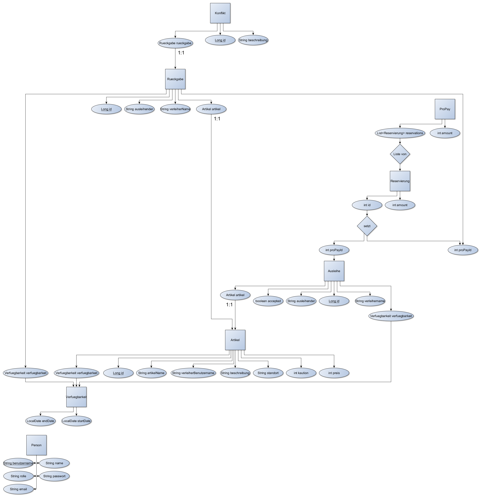

# Leih24

Roses are red, +
Violets are blue, +
We know, you want to leih something, +
and so do you.

# Funktionsweise

## Startseite
Beim Aufruf der Anwendung sieht man die Startseite, auf der bereits eine Übersicht über alle
verfügbaren Artikel angezeigt wird, sowie Links zur Anmeldung, Registrierung und eine Suchfunktion
in der Navigationsleiste am oberen Bildschirmrand. Möchte man eine andere Seite sehen, beispielsweise
die Detailseite eines Artikels, so muss man sich mit seinem Benutzernamen und Passwort anmelden, bzw.
sich registrieren. Meldet man sich an, findet man auch einen Link auf das eigene Profil in der
Navigationsleiste auf jeder Seite.

.Detailansicht
Ruft man die Detailansicht eines Artikels auf erhält man eine Übersicht über wichtige zusätzliche
Informationen wie Beschreibung, Standort und Verfügbarkeit. Außerdem enthält die Seite die Möglichkeit
eine Anfrage für den aufgerufenen Artikel zu erstellen.

.Ausleihen
Auf dieser Seite kann man in einem Kalender den Zeitraum auswählen kann, für den man sich den Artikel
gerne ausleihen möchte, wobei der verfügbare Zeitraum grün markiert ist. Bestätigt man nun seine Auswahl,
so wird eine Anfrage an den Besitzer des Artikels gesendet, falls man genug Geld auf seinem ProPay-Konto
hat, um die Kaution und die Kosten für den angegebenen Zeitraum zu bezahlen und der Besitzer erhält eine
Nachricht.

## Profil
Alle folgenden Schritte des Ausleihvorgangs lassen sich über die Profilseite vornehmen. Außerdem werden
alle von dieser Person angebotenen Artikel auf ihrer Profilseite angezeigt und lassen sich von ihr bearbeiten.

.Hier können sie ihr Konto aufladen
Über dieses Eingabefeld lässt sich das eigene ProPay-Konto mit der eingegebenen Menge aufladen.

### Profil bearbeiten
Über den Knopf "Profil bearbeiten" lassen sich der Name(Nicht der Benutzername) und die Mail-Adresse
nachträglich ändern.

### Neuen Artikel erstellen
Über den Knopf "Artikel erstellen" lassen sich neue Artikel erstellen.

### Anfragen ansehen
Möchte ein Verleiher nachsehen, ob es Anfragen für einen seiner Artikel gibt, dann klickt er
auf seiner Profilseite auf "Anfragen ansehen". Dort kann er alle offenen und bereits angenommenen
Anfragen einsehen und offene Anfragen entweder annehmen, oder ablehnen. Bei beiden Optionen wird
eine Nachricht an den Ersteller der Anfrage geschickt, in der er über die Antwort auf seine Anfrage
benachrichtigt wird. Wenn die Anfrage angenommen wurde, wird außerdem die Kaution reserviert und
die Kosten für den Leihzeitraum werden an den Verleiher überwiesen.

### Ausgeliehene Artikel ansehen
Wurde die Anfrage angenommen, so kann der Leihende in seinem Profil über
"Ausgeliehene Artikel ansehen" den entsprechenden Artikel sehen, mit der Möglichkeit den
Artikel zurückzugeben. Wird der Artikel zurückgegeben, so erhält der Verleiher eine Nachricht.

### Rückgaben ansehen
Der Verleiher findet in seinem Profil über "Rückgaben ansehen" eine Übersicht über alle an ihn
zurückgegebenen Artikel und kann nach einer Prüfung des Zustands der Rückgabe entscheiden, ob sie
in einem akzeptablen Zustand ist, oder ob er aufgrund eines schlechten Zustands die Kaution
einbehalten möchte. Ist die Rückgabe in schlechtem Zustand, so kann er über einen Knopf die
Konfliktlösungsstelle kontaktieren.

.Mangelhafter Zustand
Dieser Knopf leitet auf eine Seite weiter, auf der man eine Beschreibung des Problems eingeben und diesen an
die Konfliktlösungsstelle schicken kann, wodurch außerdem der Leihende eine Nachricht erhält, die ihn darauf
hinweist, dass es zu seiner Rückgabe eine Beschwerde gibt.

### Nachrichten ansehen
Nachrichten lassen sich über das Profil und den Knopf "Nachrichten ansehen" abrufen, wo sie
vom Empfänger gelesen und gelöscht werden können.

.Konflikte
Ein Admin kann über die Nachrichtenseite auf die Konfliktübersicht zugreifen,
die alle offenen, oder aktuell von ihm bearbeiteten Konflikte anzeigt. Offene Konflikte können nun
vom Admin angenommen werden, was bedeutet, dass er diesen Konflikt bis zu einer Entscheidung
bearbeiten wird. Die von ihm bearbeiteten Konflikte enthalten neben den Beteiligten, der Beschreibung
und dem Artikel auch die E-Mail-Adresse der Beteiligten, wodurch sich der Admin mit ihnen in Kontakt
setzen kann, um diesen Konflikt zu lösen. Wenn er sich entschieden hat, ob die Beschwerde gerechtfertigt
ist, kann er auswählen, wem die Kaution zusteht und kann dies über das Drücken des entsprechenden Knopfes
tun. Beide Beteiligten erhalten eine Nachricht, in welcher sie über die Entscheidung des Admins benachrichtigt
werden, außerdem wird das für die Kaution reservierte Geld je nach Entscheidung entweder wieder freigegeben,
oder an den Verleiher überwiesen.

### Transaktionen Übersicht
Hier lassen sich die Leihen von bereits zurückgegebenen Artikeln ansehen.

## Klassen
Diese Skizze sollte wohl am besten veranschaulichen können, wie die Klassen zusammenhängen:

