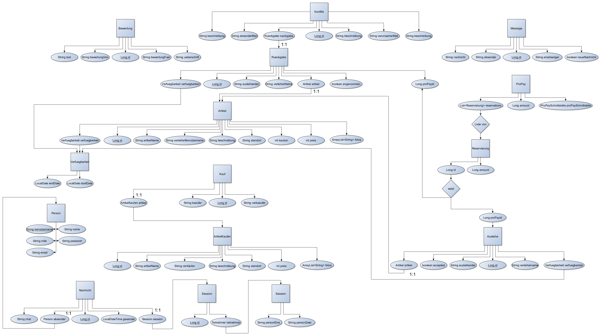

# Leih24

Roses are red, +
Violets are blue, +
We know, you want to leih something, +
and so do you.

# Funktionsweise

## Startseite
Beim Aufruf der Anwendung sieht man die Startseite, auf der bereits eine Übersicht über alle
verfügbaren Artikel, unterteilt in zu verkaufende und zu verleihende Artikel, angezeigt wird, sowie
Links zur Anmeldung, Registrierung und eine Suchfunktion in der Navigationsleiste am oberen Bildschirmrand.
Die Detailansicht der Artikel ist auch für nicht angemeldete Nutzer sichtbar. Möchte man jedoch eine
andere Seite sehen, oder beispielsweise einen Artikel ausleihen, so muss man sich mit seinem Benutzernamen
und Passwort anmelden, bzw. sich registrieren. Meldet man sich an, findet man auch einen Link auf das
eigene Profil, zu den Nachrichten, zum Erstellen eines Artikels und zum Chat (Briefumschlag-Symbol)
in der Navigationsleiste auf jeder Seite.

### Detailansicht
Ruft man die Detailansicht eines Artikels auf erhält man eine Übersicht über wichtige zusätzliche
Informationen wie Beschreibung, Standort und Verfügbarkeit. Hier lässt sich der Standort auch über Google
Maps und ein Foto des Artikels ansehen. Außerdem enthält die Seite die Möglichkeit eine Anfrage für den
zu verleihenden Artikel zu erstellen, bzw. den zum Verkauf stehenden Artikel zu kaufen.

### Ausleihen
Auf dieser Seite kann man in einem Kalender den Zeitraum auswählen, für den man sich den Artikel
gerne ausleihen möchte, wobei der verfügbare Zeitraum grün markiert ist. Bestätigt man nun seine Auswahl,
so wird eine Anfrage an den Besitzer des Artikels gesendet, falls man genug Geld auf seinem ProPay-Konto
hat, um die Kaution und die Kosten für den angegebenen Zeitraum zu bezahlen.

## Profil
Alle folgenden Schritte des Ausleihvorgangs lassen sich über die Profilseite vornehmen. Außerdem werden
alle von dieser Person angebotenen Artikel auf ihrer Profilseite angezeigt und lassen sich von ihr bearbeiten.
Wenn das angezeigte Profil nicht dem eingeloggten Nutzer gehört, werden nur die zum Profil gehörenden Artikel
angezeigt, sowie ein Link um mit dem Besitzer des Profils zu chatten und ein Link um Bewertungen zum
Verleiher/Verkäufer anzusehen, oder eine neue Bewertung zu erstellen. Hat man neue Nachrichten, oder vergessen
einen Artikel zurückzugeben erhält man außerdem ein Pop-up zur Erinnerung, sowie eine Mail im Falle
eines nicht zurückgegebenen Artikel.

.Hier können sie ihr Konto aufladen
Über dieses Eingabefeld lässt sich das eigene ProPay-Konto mit der eingegebenen Menge Geld aufladen.

### Profil bearbeiten
Über den Knopf "Profil bearbeiten" lassen sich der Name(Nicht der Benutzername) und die Mail-Adresse
nachträglich ändern.

### Neuen Artikel erstellen
Über den Knopf "Artikel erstellen" lassen sich neue Artikel einstellen. Dabei muss man zunächst
auswählen, ob man den Artikel verkaufen, oder nur verleihen möchte. Danach muss man alle notwendigen
Informationen eingeben und hat die Möglichkeit ein Foto hinzuzufügen.

### Anfragen ansehen
Möchte ein Verleiher nachsehen, ob es Anfragen für einen seiner Artikel gibt, dann klickt er
auf seiner Profilseite auf "Anfragen ansehen". Dort kann er alle offenen und bereits angenommenen
Anfragen einsehen und offene Anfragen entweder annehmen, oder ablehnen. Wenn die Anfrage angenommen
wurde, wird außerdem die Kaution reserviert und die Kosten für den Leihzeitraum werden an den
Verleiher überwiesen.

### Ausgeliehene Artikel ansehen
Wurde die Anfrage angenommen, so kann der Leihende in seinem Profil über
"Ausgeliehene Artikel ansehen" den entsprechenden Artikel sehen, mit der Möglichkeit den
Artikel zurückzugeben.

### Rückgaben ansehen
Der Verleiher findet in seinem Profil über "Rückgaben ansehen" eine Übersicht über alle an ihn
zurückgegebenen Artikel und kann nach einer Prüfung des Zustands der Rückgabe entscheiden, ob sie
in einem akzeptablen Zustand ist, oder ob er aufgrund eines schlechten Zustands die Kaution
einbehalten möchte. Ist die Rückgabe in schlechtem Zustand, so kann er über einen Knopf die
Konfliktlösungsstelle kontaktieren.

.Mangelhafter Zustand
Dieser Knopf leitet auf eine Seite weiter, auf der man eine Beschreibung des Problems eingeben und diesen an
die Konfliktlösungsstelle schicken kann.

### Nachrichten ansehen
Nachrichten lassen sich über das Profil und den Knopf "Nachrichten ansehen" abrufen, wo sie vom Empfänger
gelesen und gelöscht werden können. Hier werden Nachrichten angezeigt, die automatisch erstellt werden,
wenn man einen Artikel erstellt, wenn ein eigener Artikel ausgeliehen/gekauft wurde, oder ähnliche
Systemnachrichten. Wenn man sich mit einer gültigen E-Mail-Adresse angemeldet hat, so erhält man zusätzlich
per E-Mail wichtige Benachrichtigungen.

.Konflikte
Ein Admin kann über die Nachrichtenseite auf die Konfliktübersicht zugreifen,
die alle offenen, oder aktuell von ihm bearbeiteten Konflikte anzeigt. Offene Konflikte können nun
vom Admin angenommen werden, was bedeutet, dass er diesen Konflikt bis zu einer Entscheidung
bearbeiten wird. Die von ihm bearbeiteten Konflikte enthalten neben den Beteiligten, der Beschreibung
und dem Artikel auch die E-Mail-Adresse der Beteiligten, wodurch sich der Admin mit ihnen in Kontakt
setzen kann, um diesen Konflikt zu lösen. Wenn er sich entschieden hat, ob die Beschwerde gerechtfertigt
ist, kann er auswählen, wem die Kaution zusteht und kann dies über das Drücken des entsprechenden Knopfes
tun. Das für die Kaution reservierte Geld wird je nach Entscheidung entweder wieder freigegeben, oder an
den Verleiher überwiesen.

### Transaktionen Übersicht
Hier sieht man selbst ausgeliehene wie verliehene Artikel und gekaufte bzw. verkaufte Artikel, mit allen wichtigen Informationen.

## Chat
Beim Aufruf des Chats öffnet sich ein kleineres Fenster, dass sich je nachdem, von wo es aufgerufen wurde wie
folgt verhält:

### Übersicht
Ruft man den Chat über das Briefumschlag-Symbol in der Navigationsleiste auf, ist die Sidebar geöffnet, über
die sich eine bestehende Chat-Session auswählen lässt, wodurch diese Session (s.u.) geöffnet wird.

### Session
Ruft man den Chat über das Profil eines anderen Benutzers auf, oder wählt auf der Übersicht (s.o.) eine bestehende Session
aus, so ist Sidebar minimiert und der Chat mit dem Benutzer ist sichtbar, öffnet man die Sidebar, lassen sich auch
die in Übersicht (s.o.) beschriebenen Funktionen nutzen.

### Anpassung an neue Minimalanforderung
Die Implementierung der neuen Anforderungen ging relativ zügig.
Wir haben zunächst überlegt die Klasse Artikel um einen Flag zu erweitern, der anzeigt, ob
ein Artikel zum Verleihen oder Verkauf zur Verfügung steht, jedoch würde man dabei viel unnötige Information mitspeichern,
wie die Verfügbarkeit und Kaution. Außerdem wären Feldnamen irreführend, da ein Verkäufername so Verleihername hieße.
Deswegen haben wir eine neue Entity ArtikelKaufen hinzugefügt, die die nötigen Informationen enthält.
(Damit einhergehend natürlich auch ein ArtikelKaufenRepository).
Beim Erstellen eines Artikels auf der Seite wird man nun zunächst auf eine Seite weitergeleitet, wo man auswählt, ob der Artikel zum
Verleihen oder zum Verkaufen ist. Danach wird man entsprechend seiner vorher getätigten Wahl auf eine neue Seite weitergeleitet,
wo man Artikelinformationen einträgt. Genau wie bei Ausleihe haben wir auch eine Entity Kauf mit entsprechendem Repository hinzugefügt.
Darin werden alle nötigen Informationen zu einem Kauf abgespeichert.
Die restliche Anpassung ging gut, wir mussten lediglich die HTMLs anpassen mit zusätzlichen Knöpfen und neuen "Abschnitten" auf den Seiten,
um z.B. auf der Startseite alle zum Kauf verfügbaren Artikel anzuzeigen.

## Klassen
Die folgenden Skizzen sollten wohl am besten veranschaulichen können, wie die Klassenstruktur aussieht. +

